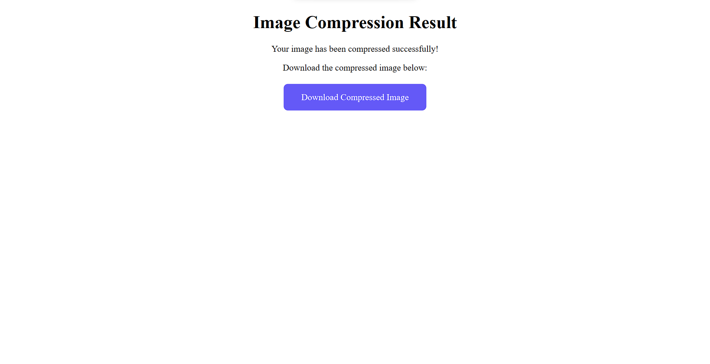

# **Image Quality Reducer**

## To Run Locally

```bash
pip install virtualenv
python -m virtualenv venv
venv\Scripts\activate
```

## To Run On Docker

```bash
docker build . -t capstone_project
docker run -p 5050:8081 capstone_project
```

## Screenshot

##### Index Page


##### Result Page



##### Image with high Quality


##### Compressed_img


